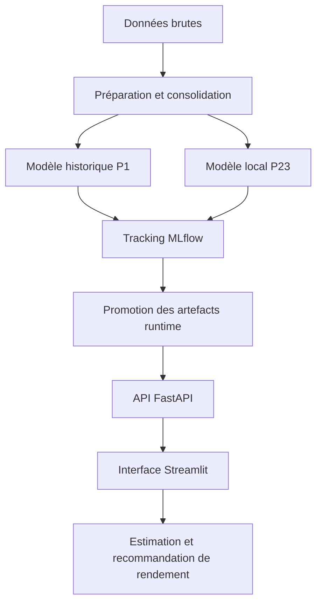

<!--
.. title: Optimiser le rendement agricole
.. slug: optimisation-des-rendements-agricoles
.. description: Prototype Data & ML d’aide à la décision agricole permettant d’estimer le rendement d’une culture et de comparer plusieurs cultures selon les conditions locales d’une parcelle.
.. date: 2026-05-13 00:00:01
-->

# Rapport de conduite de projet

## Optimisation des rendements agricoles

### Description courte

Ce projet vise à aider un exploitant agricole à estimer le rendement attendu d’une culture et à comparer plusieurs cultures possibles pour une même parcelle.  
La solution repose sur deux modèles complémentaires : un modèle historique et un modèle local basé sur les conditions de terrain.

---

## 1. Résumé exécutif

Le projet `optimisation-des-rendements-agricoles` part d’une question simple, mais importante pour le monde agricole : comment aider un agriculteur à choisir une culture en s’appuyant sur des données plutôt que sur une intuition seule ?

Au départ, l’ambition était large. Il était question d’optimiser les rendements, mais aussi d’évaluer la rentabilité. L’audit des données a rapidement montré une limite forte : aucune donnée financière fiable n’était disponible. Le projet ne contenait ni prix de vente, ni coûts de production, ni coûts logistiques, ni indicateurs de marge.

La décision structurante a donc été de recentrer le projet sur une promesse solide : estimer et comparer des rendements agricoles, sans prétendre calculer une rentabilité économique complète.

La solution finale combine deux approches :

- un modèle historique, appelé `P1`, qui estime un rendement de référence à partir du pays et de la culture ;
- un modèle local, appelé `P23`, qui ajuste cette estimation selon les conditions de parcelle : sol, météo, irrigation, engrais, pluie, température et durée avant récolte.

La logique de prédiction est volontairement explicable :

```text
rendement final = P1 + (P3 - P2)
````

Autrement dit, le système part d’un rendement historique de référence, puis applique un ajustement local lié aux conditions concrètes de la parcelle.

Le prototype est complet : il dispose d’une API FastAPI, d’une interface Streamlit, d’un suivi d’expériences avec MLflow, d’une conteneurisation Docker et de workflows GitHub Actions pour tester, entraîner et déployer l’application.

---

## 2. Contexte et besoin métier

### 2.1 Le point de départ

L’histoire du projet commence chez Agritech Answers, une entreprise spécialisée dans l’aide à la décision agricole. L’objectif est de transformer une demande métier en prototype Data & ML utilisable.

Le besoin vient d’un problème concret : un agriculteur doit choisir quoi cultiver sur une parcelle, alors que le rendement dépend de nombreux facteurs. Certains sont globaux, comme le pays, l’historique agricole ou la culture choisie. D’autres sont locaux, comme la météo, l’irrigation, le type de sol ou l’usage d’engrais.

La question métier peut donc être formulée ainsi :

> Pour une parcelle donnée, quelle culture semble offrir le meilleur rendement estimé ?

Le projet ne cherche pas à remplacer l’expertise agricole. Il apporte un outil d’aide à la décision, lisible, reproductible et fondé sur des données.

### 2.2 Les utilisateurs concernés

Le projet s’adresse principalement à quatre profils.

| Partie prenante                    | Attente principale                                                        |
| ---------------------------------- | ------------------------------------------------------------------------- |
| Agriculteur ou conseiller agricole | Obtenir une estimation simple et compréhensible                           |
| Lead Data Scientist                | Vérifier la méthode, la robustesse et la traçabilité                      |
| Équipe technique                   | Disposer d’une API, d’une interface et d’un déploiement reproductibles    |
| Évaluateur projet                  | Retrouver les preuves attendues : MLflow, pipeline, CI/CD, rapport métier |

### 2.3 Le besoin reformulé

Après analyse, le besoin a été reformulé autour de deux fonctionnalités principales :

1. prédire le rendement d’une culture choisie dans un contexte donné ;
2. recommander un classement de cultures possibles pour une parcelle.

Cette reformulation est importante. Elle permet d’éviter une promesse trop large et de rester aligné avec les données réellement disponibles.

Le projet parle donc de rendement agricole, pas de profit financier.

---

## 3. Audit des données et de la solution envisagée

### 3.1 Les données disponibles

L’audit a mis en évidence deux familles de données.

| Source                           | Rôle dans le projet                                       | Granularité                |
| -------------------------------- | --------------------------------------------------------- | -------------------------- |
| `data/simulation/crop_yield.csv` | Mesurer l’effet des conditions locales de parcelle        | Observation simulée locale |
| `data/historique/yield.csv`      | Construire la cible historique de rendement               | Pays / culture / année     |
| `data/historique/rainfall.csv`   | Ajouter la pluie annuelle                                 | Pays / année               |
| `data/historique/temp.csv`       | Ajouter la température annuelle                           | Pays / année               |
| `data/historique/pesticides.csv` | Ajouter les intrants pesticides                           | Pays / année               |
| `data/dataset_consolide.csv`     | Servir de base consolidée pour la modélisation historique | Pays / culture / année     |

Le premier enseignement important est que ces données ne décrivent pas exactement le même niveau de réalité.

Les données historiques racontent une évolution globale : un rendement par pays, culture et année.
Les données de simulation décrivent plutôt une situation locale : type de sol, météo, irrigation, engrais et conditions de récolte.

### 3.2 La décision d’audit

Une fusion directe de toutes les données aurait été séduisante, mais fragile. Elle aurait donné l’impression de construire un grand modèle unique, alors que les sources n’ont pas la même granularité.

Le projet a donc fait un choix plus prudent : ne pas forcer une jointure artificielle.

La solution conserve deux briques séparées :

- une brique historique pour estimer une base de rendement ;
- une brique locale pour ajuster cette base selon les conditions de parcelle.

Cette décision rend la solution plus claire, plus défendable et plus facile à expliquer.

---

## 4. Solution technique retenue

### 4.1 Les options étudiées

Trois options principales ont été envisagées.

| Option                                        | Avantage                       | Limite                                                   | Décision    |
| --------------------------------------------- | ------------------------------ | -------------------------------------------------------- | ----------- |
| Un modèle global unique                       | Simple à présenter             | Fusion fragile entre données différentes                 | Non retenue |
| Une recommandation directe par classification | Résultat immédiat              | Moins explicable et peu adaptée sans données économiques | Non retenue |
| Deux modèles complémentaires                  | Respecte la nature des données | Architecture un peu plus complexe                        | Retenue     |

L’option retenue est donc une architecture à deux modèles.

### 4.2 Architecture générale



Cette architecture suit une logique simple : préparer les données, entraîner les modèles, tracer les expériences, promouvoir les artefacts validés, puis servir les prédictions dans une application.

### 4.3 Composants principaux

| Composant                                   | Rôle                                                   |
| ------------------------------------------- | ------------------------------------------------------ |
| `notebooks/preparation.ipynb`               | Exploration, nettoyage, ACP et préparation des données |
| `scripts/experience_1.py`                   | Entraînement et optimisation du modèle historique      |
| `scripts/train_simulation_model.py`         | Entraînement du modèle local                           |
| `scripts/promote_registered_model.py`       | Export des modèles MLflow vers les artefacts runtime   |
| `scripts/validate_runtime.py`               | Vérification du chargement applicatif des modèles      |
| `main.py`                                   | API FastAPI                                            |
| `streamlit/src/streamlit_app.py`            | Interface utilisateur                                  |
| `.github/workflows/deploy_hf_space.yml`     | Déploiement applicatif                                 |
| `.github/workflows/train_full_pipeline.yml` | Pipeline d’entraînement manuel                         |

---

## 5. Modélisation

### 5.1 Modèle historique P1

Le modèle `P1` sert à estimer un rendement de référence à partir des données historiques.

Il répond à la question suivante :

> Quel rendement peut-on attendre pour une culture donnée dans un pays donné, au regard de l’historique disponible ?

Le modèle retenu est un `RandomForestRegressor`.

| Élément          | Valeur                    |
| ---------------- | ------------------------- |
| Modèle           | `RandomForestRegressor`   |
| Run MLflow       | `random_forest_search_01` |
| Registered model | `p1_historical_pipeline`  |
| Version exportée | `7`                       |

Métriques principales :

| Métrique                        |   Valeur |
| ------------------------------- | -------: |
| RMSE test                       | `2.0593` |
| MAE test                        | `0.8026` |
| R² test                         | `0.9468` |
| RMSE validation croisée moyenne | `1.5814` |
| R² validation croisée moyen     | `0.9623` |

Ces résultats indiquent que le modèle historique capte correctement les grandes tendances de rendement dans les données disponibles.

### 5.2 Modèle local P23

Le modèle `P23` sert à mesurer l’effet des conditions locales de parcelle.

Il répond à une autre question :

> Comment les conditions concrètes de terrain modifient-elles le rendement attendu ?

Le modèle retenu est une `LinearRegression`.

| Élément          | Valeur                    |
| ---------------- | ------------------------- |
| Modèle           | `LinearRegression`        |
| Registered model | `p23_simulation_pipeline` |
| Version exportée | `6`                       |

Métriques principales :

| Métrique  |   Valeur |
| --------- | -------: |
| RMSE test | `0.4967` |
| MAE test  | `0.3961` |
| R² test   | `0.9140` |

Ce modèle local n’a pas le même rôle que `P1`. Il ne remplace pas le modèle historique. Il apporte un ajustement lié aux conditions de parcelle.

---

## 6. Méthode projet

### 6.1 Une démarche inspirée de CRISP-DM

La conduite du projet suit une démarche proche de CRISP-DM, adaptée à un prototype MLOps.

| Phase                     | Objectif                                   | Livrable principal                                 |
| ------------------------- | ------------------------------------------ | -------------------------------------------------- |
| Compréhension métier      | Clarifier le besoin et les limites         | `ressources/mission.md`, `ressources/questions.md` |
| Compréhension des données | Identifier les sources et les granularités | `notebooks/preparation.ipynb`                      |
| Préparation               | Nettoyer et consolider les données         | `data/dataset_consolide.csv`                       |
| Modélisation              | Entraîner, comparer et tracer les modèles  | Scripts d’entraînement, MLflow                     |
| Évaluation                | Vérifier les métriques et la robustesse    | Artefacts, tests, métadonnées                      |
| Déploiement               | Rendre le prototype utilisable             | FastAPI, Streamlit, Docker, Hugging Face           |

### 6.2 Le récit du projet

Le projet a avancé par étapes.

Au début, l’enjeu était de comprendre les données. La tentation aurait été de tout fusionner rapidement pour produire un premier modèle. Mais cette approche aurait créé une solution difficile à justifier.

La première décision forte a donc été d’accepter la complexité des données. Les données historiques et les données locales ne racontaient pas la même chose. Plutôt que de masquer cette différence, le projet l’a utilisée comme base d’architecture.

Ensuite, un premier modèle a été construit pour obtenir une estimation historique du rendement. Ce modèle donne un point de départ robuste.

Puis un second modèle a été ajouté pour intégrer les conditions de parcelle. Cette étape permet de rapprocher la prédiction de la situation concrète de l’utilisateur.

Enfin, la solution a été transformée en application : une API pour servir les prédictions, une interface pour les rendre accessibles, et une chaîne MLOps pour suivre les modèles et sécuriser le déploiement.

Le projet raconte donc une progression claire :

```text
comprendre les données
-> refuser une fusion fragile
-> construire deux modèles complémentaires
-> rendre la prédiction explicable
-> livrer une application démontrable
```

---

## 7. Aide à la décision

L’application permet à l’utilisateur de :

- choisir un pays ;
- choisir une culture ;
- renseigner les conditions de parcelle ;
- obtenir un rendement estimé ;
- comparer plusieurs cultures possibles ;
- consulter un classement des cultures les plus prometteuses en rendement.

La recommandation produite n’est pas une décision automatique. Elle doit être lue comme une aide au raisonnement.

Par exemple, une culture peut apparaître intéressante en rendement, mais rester moins pertinente en pratique si elle demande des semences indisponibles, des coûts élevés, une main-d’œuvre spécifique ou un marché local peu favorable.

La solution reste donc volontairement prudente : elle compare des rendements estimés, mais ne conclut pas sur la rentabilité économique.

---

## 8. Suivi, pilotage et industrialisation

### 8.1 Indicateurs de pilotage

Le projet est piloté à travers des preuves concrètes dans le dépôt.

| Axe de suivi       | Preuve associée                                   |
| ------------------ | ------------------------------------------------- |
| Fonctionnel        | API, interface Streamlit, Space Hugging Face      |
| Données            | `data/dataset_consolide.csv`, artefacts d’analyse |
| Modèle             | Runs MLflow, métriques, registered models         |
| Qualité logicielle | Tests `pytest`, structure des scripts             |
| Reproductibilité   | `requirements.txt`, `Dockerfile`                  |
| Déploiement        | GitHub Actions, workflow de déploiement           |

### 8.2 Rôle de MLflow

MLflow sert de carnet d’expériences.

Il permet de conserver :

- les runs ;
- les paramètres ;
- les métriques ;
- les artefacts ;
- les modèles enregistrés.

Les deux modèles suivis sont :

- `p1_historical_pipeline` ;
- `p23_simulation_pipeline`.

Cette traçabilité est essentielle pour justifier les choix techniques et éviter qu’un modèle soit promu sans preuve de performance.

### 8.3 Rôle de GitHub Actions

GitHub Actions permet de séparer deux moments du cycle de vie :

- l’entraînement ;
- le déploiement.

Le workflow de déploiement ne réentraîne pas les modèles à chaque modification. Il teste, construit et déploie l’application à partir d’artefacts déjà validés.

Cette séparation est importante. Elle évite de rendre le déploiement dépendant d’un entraînement potentiellement long, coûteux ou instable.

Le pipeline complet peut être lancé avec :

```bash
python3 scripts/run_full_pipeline.py
```

Il orchestre :

1. la préparation des données ;
2. l’entraînement du modèle historique ;
3. l’entraînement ou la réutilisation du modèle local ;
4. l’enregistrement MLflow ;
5. la promotion des modèles runtime ;
6. la validation applicative.

---

## 9. Résultats métier

Le prototype répond à deux questions principales.

Première question :

> Pour cette culture, dans ce pays et avec ces conditions de parcelle, quel rendement peut être estimé ?

Deuxième question :

> Parmi les cultures supportées, lesquelles semblent les plus intéressantes en rendement pour cette parcelle ?

L’analyse exploratoire a aussi permis de confirmer plusieurs intuitions métier :

- la pluie joue un rôle structurant ;
- la température apporte une information complémentaire ;
- la durée avant récolte influence le résultat local ;
- l’irrigation, l’engrais, le type de sol et la météo modifient le rendement estimé.

La valeur du projet ne se limite donc pas à un score de modèle. Elle réside dans la construction d’une chaîne complète :

```text
données -> modèles -> API -> interface -> recommandation de rendement
```

---

## 10. Risques, limites et réponses apportées

| Sujet             | Risque                                | Réponse projet                                     |
| ----------------- | ------------------------------------- | -------------------------------------------------- |
| Rentabilité       | Faire croire à un calcul de profit    | Recentrage explicite sur le rendement              |
| Données           | Fusionner des sources incompatibles   | Séparation entre modèle historique et modèle local |
| Modèle            | Surinterpréter les métriques          | Documentation des limites et des métriques         |
| Recommandation    | Recommander hors domaine connu        | Limitation aux couples pays / culture supportés    |
| Déploiement       | Casser l’application après évolution  | Tests, Docker, validation runtime                  |
| Industrialisation | Dépendance au notebook de préparation | Exécution headless via script dédié                |

Les principales limites actuelles sont les suivantes :

- absence de données financières ;
- impossibilité de calculer une marge ou un profit ;
- préparation encore partiellement dépendante d’un notebook ;
- analyse SHAP locale, mais pas encore d’analyse globale complète ;
- validation croisée structurée pour `P1`, mais pas encore pour `P23` ;
- recommandations limitées aux cultures et pays supportés par les données.

Ces limites ne bloquent pas la démonstration. Elles définissent plutôt les prochaines étapes pour passer d’un prototype à un outil plus industrialisé.

---

## 11. Recommandations

Pour poursuivre le projet, les recommandations sont les suivantes :

1. intégrer des données économiques pour passer du rendement à la marge ;
2. transformer progressivement `preparation.ipynb` en script Python natif ;
3. renforcer l’évaluation du modèle `P23` avec validation croisée ;
4. ajouter des seuils automatiques de qualité avant promotion d’un modèle ;
5. mettre en place un monitoring de production : dérive des données, erreurs API, temps de réponse ;
6. produire une documentation utilisateur courte pour expliquer comment lire une recommandation ;
7. enrichir les données avec des informations plus locales : région, type d’exploitation, saison, prix de marché.

---

## 12. Conclusion

Le projet `optimisation-des-rendements-agricoles` a suivi une trajectoire cohérente : partir d’un besoin agricole concret, analyser les données disponibles, accepter leurs limites, puis construire une solution explicable et déployable.

La décision la plus importante a été de ne pas promettre plus que ce que les données permettent. Le prototype n’optimise pas une rentabilité financière complète. Il aide à comparer des cultures sur la base du rendement estimé.

Cette approche rend le projet plus crédible. Elle montre qu’un bon projet Data & ML ne consiste pas seulement à entraîner un modèle performant. Il consiste aussi à formuler correctement le problème, à respecter les données, à expliquer les choix techniques et à livrer une solution utilisable.

Le prototype est donc prêt pour une démonstration métier et pour une discussion d’industrialisation.
